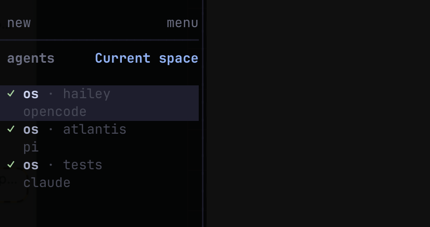
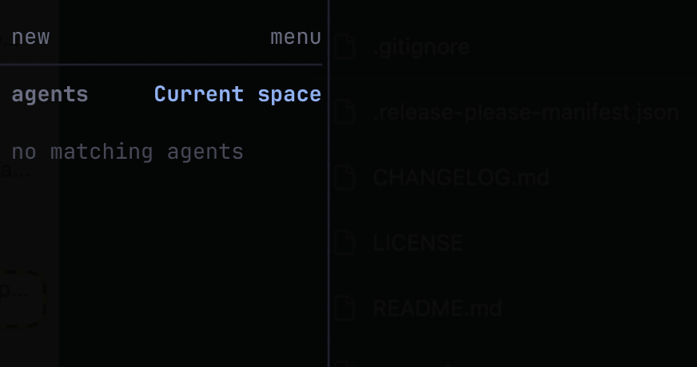

# herdr-space-scoped-agents

[](https://github.com/ShankyJS/herdr-space-scoped-agents/actions/workflows/ci.yml)
[](https://github.com/ShankyJS/herdr-space-scoped-agents/releases/latest)
[](LICENSE)

<p align="center">
  <a href="#how-it-works">how it works</a> · <a href="#install">install</a> · <a href="#actions">actions</a> · <a href="#windows">windows</a> · <a href="#limitations">limitations</a> · <a href="#build-from-source">build</a> · <a href="specs/">specs</a>
</p>

A [herdr](https://herdr.dev) plugin that scopes the **agent panel** to the space
you're focused on. Only the agents in the current space are listed; switch
spaces and the panel follows. Notifications, toasts, and every other surface
stay global — this touches the agent panel and the agent-keybind navigation
order only.

Without it, the panel lists every agent across every space at once. In a
workspace with many spaces and many agents, the panel you care about is buried.

## What it looks like

The agent panel header reads **Current space**, and only the focused space's
agents are listed. Switch to a space with no agents and the panel simply shows
`no matching agents` — nothing from other spaces leaks in.

| Focused on a space with agents | Focused on a space with none |
| :---: | :---: |
|  |  |

## How it works

herdr **0.7.5+** exposes *transient declarative agent views* over its API socket
through the `agent.view.set` / `agent.view.clear` methods. This plugin sets a
view filtered to the focused space:

```jsonc
{ "op": "eq", "field": "workspace_id",
  "value": { "context": "current_workspace_id" } }
```

The `current_workspace_id` context makes the view track whichever space has
focus. Agent views are **transient server-side state** — not written to
`config.toml`, and dropped on a server restart. So the plugin also declares a
`workspace.focused` event hook that re-asserts the active mode on every space
switch, which additionally restores it after a restart on your first focus.

### Modes

The plugin has two modes, and your choice **persists** (stored in the plugin
state dir, so it survives space switches and restarts):

- **`current`** (default) — scope the panel to the focused space.
- **`all`** — show agents from every space.

The `workspace.focused` hook runs `sync`, which re-asserts whichever mode is
active. That's what makes **`all` stick** — switching spaces won't silently snap
you back to scoped.

#### Switching modes

There is **no config key** to edit (unlike a `ui.*` setting). You set the mode by
running an action **once**, and it sticks. Two ways:

1. **A keybinding** (recommended) — bind `toggle` to a key (see
   [Actions](#actions)) and press it to flip `current` ↔ `all`.
2. **The terminal**:
   ```bash
   herdr plugin action invoke current --plugin herdr-space-scoped-agents  # scope
   herdr plugin action invoke all     --plugin herdr-space-scoped-agents  # show all
   herdr plugin action invoke toggle  --plugin herdr-space-scoped-agents  # flip
   ```

Herdr's actions are also invokable however your Herdr version surfaces plugin
actions; a keybinding is the most reliable trigger.

To see which mode is active, look at the agent panel: only the focused space's
agents (with the **Current space** header) means `current`; every space's agents
means `all`.

The work is done by a small, dependency-free **Go binary** that speaks the API
socket's newline-delimited JSON protocol — a unix socket on macOS/Linux, a
named pipe on Windows — reading the socket path from the `HERDR_SOCKET_PATH`
environment variable herdr injects into every plugin command.

## Install

```bash
herdr plugin install ShankyJS/herdr-space-scoped-agents
herdr plugin list
```

On install, herdr runs a build step that **downloads the prebuilt binary for
your platform** from the matching [GitHub Release](https://github.com/ShankyJS/herdr-space-scoped-agents/releases)
and **verifies its SHA-256**. No toolchain required. If no prebuilt exists for
your platform/version, it falls back to building from source with `go` (see
[Build from source](#build-from-source)).

Prebuilt targets: macOS (arm64, x86-64), Linux (arm64, x86-64), Windows
(arm64, x86-64).

The filter applies automatically the first time you focus a space after install.
To apply it immediately, invoke the `current` action (below).

**Update** by reinstalling:

```bash
herdr plugin uninstall herdr-space-scoped-agents && herdr plugin install ShankyJS/herdr-space-scoped-agents
```

## Actions

Three actions, invokable via a keybinding or `herdr plugin action invoke`. Each
sets the persisted mode (above), so the choice sticks:

| Action | Effect |
| --- | --- |
| `current` | Scope to the focused space |
| `all`     | Show agents from every space |
| `toggle`  | Flip between `current` and `all` |

Bind them in herdr's `config.toml` (keybindings live in user config, not the
plugin manifest; the value is `<plugin_id>.<action_id>`):

```toml
[[keys.command]]
key = "prefix+f"
type = "plugin_action"
command = "herdr-space-scoped-agents.toggle"

[[keys.command]]
key = "prefix+F"
type = "plugin_action"
command = "herdr-space-scoped-agents.all"
```

On **Windows**, bind the `-windows`-suffixed ids instead
(`herdr-space-scoped-agents.current-windows` / `.all-windows` /
`.toggle-windows`) — see [Windows](#windows).

## Manage

```bash
herdr plugin list
herdr plugin log list --plugin herdr-space-scoped-agents   # inspect hook runs
herdr plugin disable herdr-space-scoped-agents             # turn off
herdr plugin enable  herdr-space-scoped-agents             # turn back on
herdr plugin uninstall herdr-space-scoped-agents           # remove
```

Disabling stops the hook but leaves any active view in place — run the `all`
action (or restart herdr) to drop the filter.

## Windows

Windows is supported, with two platform quirks handled in the manifest (both
learned from the [herdr-file-viewer](https://github.com/smarzban/herdr-file-viewer)
plugin's verified findings):

- **Action ids must be unique across platforms** — herdr rejects duplicate
  action ids regardless of platform gating. The Windows launchers use the ids
  `current-windows`, `all-windows`, and `toggle-windows`; bind those.
- **Launch by absolute path** — herdr can't reliably spawn a relative program on
  Windows, so every command invokes the binary through `$HERDR_PLUGIN_ROOT`
  (stripping the `\\?\` verbatim prefix herdr may report).

> Note: Windows builds are cross-compiled and CI-verified to compile, and use
> [go-winio](https://github.com/microsoft/go-winio) for the named-pipe
> transport. Runtime has had less real-hardware testing than macOS/Linux —
> reports welcome.

## Limitations

- **Re-asserts on first focus after a restart, not at boot.** herdr has no
  "server started" plugin hook, so after a restart the active mode is re-applied
  the first time you focus a space. Run an action for an immediate apply.
- **The view is transient; the mode is not.** The agent view itself lives in the
  running server (not `config.toml`), so the hook re-asserts it — but your chosen
  mode (`current`/`all`) is persisted in the plugin state dir and survives
  restarts.
- **Scopes by space only.** It filters on `workspace_id` — not by agent kind,
  status, or tab.

## Build from source

Requires [Go](https://go.dev) 1.26+.

```bash
git clone https://github.com/ShankyJS/herdr-space-scoped-agents
cd herdr-space-scoped-agents
go build -o bin/herdr-space-scoped-agents .   # .exe on Windows
herdr plugin link .
```

`herdr plugin link` does not run the install build step, so build the binary
into `bin/` yourself as above. The manifest launches `bin/herdr-space-scoped-agents`.

Cross-compile any target with `GOOS`/`GOARCH`, e.g.:

```bash
GOOS=linux GOARCH=arm64 go build -o bin/herdr-space-scoped-agents .
```

## Releasing

Releases are automated with [release-please](https://github.com/googleapis/release-please-action).
Write [Conventional Commits](https://www.conventionalcommits.org/) on `main`
(`fix:` → patch, `feat:` → minor, `feat!:`/`BREAKING CHANGE` → major). release-please
maintains a **release PR** that bumps the version (in `CHANGELOG.md` and
`herdr-plugin.toml`) from those commits. Merging that PR tags the version,
creates the GitHub release, and builds + uploads the binaries — no manual
version, changelog, or tag steps.

## Design & decisions

The engineering decisions behind this plugin — why it's a plugin at all, how the
filtering works, why Go, how it's distributed, Windows handling, and release
automation — are written up in [`specs/`](specs/), one topic per doc.

## Trust

herdr plugin listings are discovered automatically from the GitHub topic
`herdr-plugin` and are **not reviewed by herdr** — install at your own
discretion. The source is small: one Go program plus the manifest and install
scripts. It uses only the Go standard library (and go-winio on Windows), makes
no network calls at runtime, and only talks to your local herdr API socket to
set/clear the agent-panel view. The install scripts download a checksum-verified
release binary.

## License

[MIT](LICENSE).
